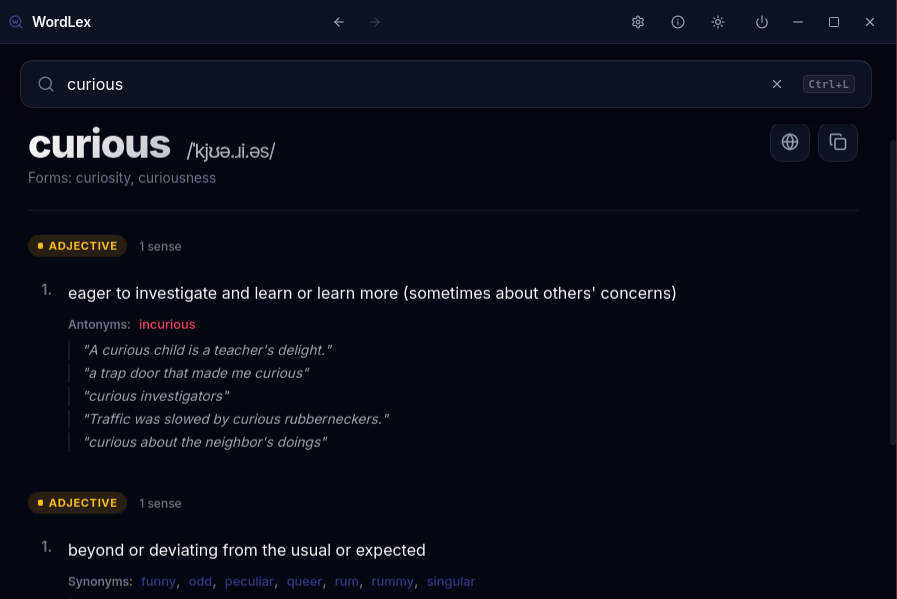

# WordLex 📖

WordLex is a blisteringly fast, beautifully designed native Linux dictionary and thesaurus. Powered by the incredibly comprehensive Open English WordNet database, WordLex provides instant, 100% offline word lookups right at your fingertips.



## 🌟 Key Features

- **100% Offline & Instant:** The entire 150,000+ word database runs locally on your machine. Zero loading times, zero internet required.
- **Global Shortcut:** Summon WordLex from anywhere on your desktop by pressing `Alt+W` (configurable in settings!).
- **Rich Word Data:** View parts of speech, synonyms, antonyms, examples, and phonetic pronunciations effortlessly.
- **Smart Clipboard Integration:** Copy any word to your clipboard (`Ctrl+C`), press `Alt+W`, and WordLex will automatically open and instantly define the word.
- **Modern Minimalist UI:** Built with React, Vite, and Tauri, featuring a beautiful glassmorphic dark-mode interface.
- **Type-Ahead Search:** Lightning-fast prefix searching powered by an optimized SQLite Full-Text Search (FTS5) index.
- **Powerful CLI:** Use WordLex from the terminal — with colored output, JSON mode for scripting, and random word discovery.
- **Vicinae Integration:** Search the dictionary directly from the [Vicinae](https://github.com/vicinaehq/vicinae) launcher with the [WordLex extension](../wordlex-vicinae).

## 🚀 Installation & Setup

### For Regular Users (Ubuntu / Debian / Linux Mint)

The easiest way to install WordLex is to use the pre-built `.deb` package.

1. Go to the [Releases Page](../../releases) on GitHub.
2. Download the latest `wordlex-v1.6.0_amd64.deb` file.
3. Open your terminal and install it:
   ```bash
   sudo apt install ./wordlex-v1.6.0_amd64.deb
   ```
4. You will now find **WordLex** in your application launcher!

### For Developers (Build from Source)

If you want to run WordLex from source or contribute to development:

**Prerequisites:**
You need Node.js (v20+ recommended) and the Rust toolchain installed. You also need the system dependencies required by Tauri on Linux:

```bash
sudo apt update
sudo apt install libwebkit2gtk-4.1-dev libgtk-3-dev libappindicator3-dev librsvg2-dev patchelf
```

**Build Steps:**

```bash
# 1. Clone the repository
git clone https://github.com/vedesh-padal/wordlex.git
cd wordlex

# 2. Install Node dependencies
npm install

# 3. Download the Database
# For WordLex to work, you MUST place the 'oewn.db' SQLite file into the resources folder.
# Create the directory if it doesn't exist:
mkdir -p src-tauri/resources
# Download the DB (approx 80MB) and place it exactly here:
wget -qO src-tauri/resources/oewn.db "https://raw.githubusercontent.com/x-englishwordnet/sqlite/master/oewn-2025-sqlite-2.3.2.sqlite.zip"
# Unzip and rename the file to 'oewn.db' inside that folder.

# 4. Run the Development Server
npm run tauri dev
```

## ⌨️ CLI Usage

WordLex includes a full-featured command-line interface:

```bash
# Open GUI and search a word
wordlex ephemeral
wordlex --search ephemeral

# Terminal output (colored)
wordlex --cli ephemeral

# JSON output (for scripts/tooling)
wordlex --cli-json ephemeral       # full word detail as JSON
wordlex --search-json eph          # prefix search results as JSON
wordlex --random-json              # random word as JSON

# Clipboard integration
wordlex --from-clipboard           # read clipboard and search in GUI

# Runtime modes (internal)
wordlex --service                  # run localhost API only (no GUI)
wordlex --ui                       # force UI startup and bootstrap service
```

## 🔌 Vicinae Extension

Search WordLex directly from the [Vicinae](https://github.com/vicinaehq/vicinae) keyboard launcher — without opening the full desktop app.

See the [wordlex-vicinae](../wordlex-vicinae) extension for installation instructions.

## 🏗️ Architecture & Technical Details

WordLex uses a sophisticated Rust backend to execute highly optimized SQLite queries against the WordNet database, passing the results safely to a React frontend via Tauri commands.

For an in-depth dive into the database schema, query optimizations, Rust application state, and UI architecture, please read the [Technical Details Guide](TECHNICAL_DETAILS.md).

## 📄 License

This project is licensed under the MIT License. The bundled Open English WordNet database operates under its own permissive open-source license.
