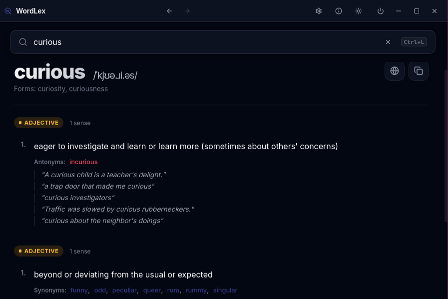

# WordLex 📖

WordLex is a blisteringly fast, beautifully designed native Linux dictionary and thesaurus. Powered by the incredibly comprehensive Open English WordNet database, WordLex provides instant, 100% offline word lookups right at your fingertips.

> **A note about this project** — WordLex is primarily an **experiment** (and a Rust learning project) rather than a commercial product. It was built by me with some AI assistance, mostly to learn and to explore what's possible with Rust + Tauri. Expect rough edges; I develop it in my spare time and test mainly on Ubuntu (26.04). If something breaks on your distro or OS, you're welcome to [open an issue](https://github.com/vedesh-padal/wordlex/issues) or send a PR — contributions are appreciated, but please don't expect rapid fixes.



## 🌟 Key Features

- **100% Offline & Instant:** The entire 150,000+ word database runs locally on your machine. Zero loading times, zero internet required.
- **Global Shortcut:** Summon WordLex from anywhere on your desktop by pressing `Alt+W` (configurable in settings!). *X11 sessions only — see [Notes & Limitations](#notes--limitations).*
- **Rich Word Data:** View parts of speech, synonyms, antonyms, examples, and phonetic pronunciations effortlessly.
- **Smart Clipboard Integration:** Copy any word to your clipboard (`Ctrl+C`), press `Alt+W`, and WordLex will automatically open and instantly define the word.
- **Modern Minimalist UI:** Built with React, Vite, and Tauri, featuring a beautiful glassmorphic dark-mode interface.
- **Type-Ahead Search:** Lightning-fast prefix searching powered by an optimized SQLite Full-Text Search (FTS5) index.
- **Powerful CLI:** Use WordLex from the terminal — with colored output, JSON mode for scripting, and random word discovery.
- **Vicinae Integration:** Search the dictionary directly from the [Vicinae](https://github.com/vicinaehq/vicinae) launcher with the [WordLex extension](../wordlex-vicinae).

## 🚀 Installation & Setup

On Linux every path installs the **same WordLex build** — the `.deb`, `.rpm`, and AppImage only differ in packaging. Pick whichever you prefer; you only need one.

Each platform ships both **x86-64 (Intel/AMD)** and **arm64 (aarch64)** builds — macOS (`.dmg`), Linux (`.deb`/`.rpm`/AppImage), and Windows (`.msi`/`.exe`, x64). Grab the asset matching your machine's architecture.

### Quick Install (one command)

The installer script picks the native package for your OS/distro **and architecture** automatically (`.deb`, `.rpm`, or `.dmg`), and falls back to the AppImage on Linux when no native package exists.

**Linux / macOS** — in a terminal:

```bash
curl -fsSL https://raw.githubusercontent.com/vedesh-padal/wordlex/main/scripts/install.sh | bash
```

**Windows** — in PowerShell:

```powershell
irm https://raw.githubusercontent.com/vedesh-padal/wordlex/main/scripts/install.ps1 | iex
```

To install a specific version instead of the latest: `VERSION=2.0.0 curl -fsSL … | bash` (or `$env:WORDLEX_VERSION = '2.0.0'` before the PowerShell one-liner).

### Ubuntu / Debian / Linux Mint — `.deb` (recommended)

1. Download `WordLex_2.0.0_amd64.deb` (or `WordLex_2.0.0_arm64.deb` on ARM64) from the [Releases Page](../../releases).
2. Install it:
   ```bash
   sudo apt install ./WordLex_2.0.0_amd64.deb   # _arm64.deb on ARM64
   ```
3. **WordLex** now appears in your application launcher, with its icon.

<details>
<summary><b>Removing the `.deb` install</b></summary>

The package manager owns the binary, desktop entry, icon, and launcher entry, so removal is a single command:
(`wordlex` is occupied, hence it will be installed with name `word-lex`, hence have to uninstall with `word-lex`, but you can invoke it with `wordlex`)

```bash
sudo dpkg -r word-lex
```

Your search history lives in `~/.local/share/com.wordlex.desktop` and is kept on uninstall; delete that folder too if you want a complete wipe.
</details>

### AppImage (any Linux distro)

<details>
<summary><b>Install</b></summary>

1. Make it executable (use `WordLex_2.0.0_aarch64.AppImage` on ARM64):
   ```bash
   chmod +x WordLex_2.0.0_amd64.AppImage
   ```
2. Run it directly — or integrate it into the desktop (real icon + menu entry + a `wordlex` command on your PATH):
   ```bash
   ./WordLex_2.0.0_amd64.AppImage --install-cli
   ```
   This is the only way an AppImage gets a proper launcher icon (bare AppImages show a generic icon in the menu/taskbar — an AppImage-wide platform limitation, e.g. also affects Antigravity and t3code).

> Both install paths use the **same desktop entry id** (`WordLex.desktop`), so you always see exactly **one** WordLex entry in the app menu — a user-level entry simply shadows the system one.
</details>

<details>
<summary><b>Removing the AppImage integration</b></summary>

```bash
./WordLex_2.0.0_amd64.AppImage --uninstall-cli
```

This removes the `wordlex` launcher, the desktop entry, and the icon. The AppImage file itself is left in place — delete it when you're done.
</details>

### Fedora / RHEL — `.rpm`

<details>
<summary><b>Install / remove</b></summary>

```bash
sudo dnf install ./WordLex-*.rpm      # or: sudo rpm -ivh ./WordLex-*.rpm
sudo dnf remove wordlex               # or: sudo rpm -e wordlex
```
</details>

### Arch / Manjaro

<details>
<summary><b>Install / remove</b></summary>

No native package — use the [AppImage](#appimage-any-linux-distro) above. Removal is just `--uninstall-cli` plus deleting the file.
</details>

### macOS / Windows

<details>
<summary><b>Install / remove</b></summary>

- **macOS:** open the `.dmg` (or extract `WordLex_x64.app.tar.gz` / `WordLex_aarch64.app.tar.gz`) and drag WordLex into Applications. Remove it by deleting the app from Applications. No CLI-launcher flag needed — the app bundle handles the icon and menu.
- **Windows:** run the `.msi` installer, or the `x64-setup.exe` (NSIS) for a per-user install. Remove it via Settings → Apps → WordLex, or the installer's uninstall entry (NSIS also places an uninstaller under `%LOCALAPPDATA%\WordLex\`). No CLI-launcher flag needed — the installer adds WordLex to the Start Menu.
</details>

### Verify your install

After any installation, confirm WordLex is actually working:

| Platform | Checks |
|---|---|
| Linux `.deb` / `.rpm` | `command -v wordlex` and `wordlex --version`; the launcher entry: `test -f ~/.local/share/applications/WordLex.desktop` |
| Linux AppImage | `ls -l ~/Applications/WordLex.AppImage` (the path used by the [Quick Install](#quick-install-one-command) script); `./WordLex_*_amd64.AppImage --version` |
| macOS | `/Applications/WordLex.app` exists; `open -a WordLex` launches it |
| Windows | WordLex appears in Start Menu / Settings → Apps; `& "$env:LOCALAPPDATA\WordLex\wordlex.exe" --version` (NSIS) or `"C:\Program Files\WordLex\wordlex.exe" --version` (MSI) |

The `--version` flag doubles as a first-run check — it initializes the dictionary database if needed.

### Complete uninstall / remove leftover data

Uninstalling the app removes the program files, but your dictionary database and search history are **kept** by design so a reinstall keeps your data. To do a complete wipe, delete the data directory too:

| OS | Data directory |
|---|---|
| Linux | `~/.local/share/com.wordlex.desktop/` |
| macOS | `~/Library/Application Support/com.wordlex.desktop/` |
| Windows | `%APPDATA%\com.wordlex.desktop\` (Roaming) |

The AppImage also leaves its file (e.g. `~/Applications/WordLex.AppImage`) and any `--install-cli` symlink/desktop entry — run `--uninstall-cli` first, then delete the file.

### Build from Source (developers)

If you want to run WordLex from source or contribute to development:

**Prerequisites:**
You need Node.js (v20+ recommended) and the Rust toolchain installed. You also need the system dependencies required by Tauri on Linux:

```bash
sudo apt update
sudo apt install libwebkit2gtk-4.1-dev libgtk-3-dev libappindicator3-dev librsvg2-dev patchelf
```

**Build Steps:**

```bash
# 1. Clone the repository
git clone https://github.com/vedesh-padal/wordlex.git
cd wordlex

# 2. Install Node dependencies
npm install

# 3. Download the Database
# For WordLex to work, you MUST place the 'oewn.db' SQLite file into the resources folder.
mkdir -p src-tauri/resources
# Download the WordNet zip (~80MB; extracts to a ~168MB .sqlite) and rename the
# extracted file to 'oewn.db'. Do NOT save the zip bytes directly as oewn.db —
# that produces a "file is not a database" error on first launch.
curl -sL "https://raw.githubusercontent.com/x-englishwordnet/sqlite/master/oewn-2025-sqlite-2.3.2.sqlite.zip" -o oewn.zip
unzip -q oewn.zip -d src-tauri/resources/
mv src-tauri/resources/oewn-*.sqlite src-tauri/resources/oewn.db
rm oewn.zip
# Verify it really is a database (must report "SQLite 3.x database"):
file src-tauri/resources/oewn.db

# 4. Run the Development Server
npm run tauri dev
```

## ⌨️ CLI Usage

WordLex includes a full-featured command-line interface. Every `--cli*` and
`--random-json` flag is fully headless — it prints to stdout and exits without
opening the GUI, so it is safe to use in scripts and from the Vicinae extension.

```bash
# Open GUI and search a word
wordlex ephemeral
wordlex --search ephemeral

# Terminal output (colored, no GUI)
wordlex --cli ephemeral

# JSON output (for scripts/tooling, no GUI)
wordlex --cli-json ephemeral       # full word detail as JSON
wordlex --search-json eph          # prefix search results as JSON
wordlex --random-json              # random word as JSON

# Clipboard integration
wordlex --from-clipboard           # read clipboard and search in GUI

# Optional localhost API service (HTTP only, no GUI window)
wordlex --service
```

## 🔌 Vicinae Extension

Search WordLex directly from the [Vicinae](https://github.com/vicinaehq/vicinae) keyboard launcher — without opening the full desktop app.

See the [wordlex-vicinae](https://github.com/vedesh-padal/wordlex-vicinae) extension for installation instructions.

## 🏗️ Architecture & Technical Details

WordLex uses a sophisticated Rust backend to execute highly optimized SQLite queries against the WordNet database, passing the results safely to a React frontend via Tauri commands.

For an in-depth dive into the database schema, query optimizations, Rust application state, and UI architecture, please read the [Technical Details Guide](docs/TECHNICAL_DETAILS.md).

## 📄 License

This project is licensed under the MIT License. The bundled Open English WordNet database operates under its own permissive open-source license.

<details>
<summary><b>⚠️ Notes & Limitations</b></summary>

### Global Shortcut on Wayland

The global shortcut (`Alt+W`) works only on **X11** sessions (both X11 and mixed "X11 over Wayland" / XWayland setups on KDE, Cinnamon, MATE, etc.). On **Wayland** desktops it does **not** work — this is an operating-system restriction, not a WordLex bug:

- Wayland compositors (GNOME, KDE Plasma Wayland, etc.) deliberately prevent apps from grabbing global keys.
- The only sanctioned path is the XDG **GlobalShortcuts** portal, which refuses to accept any process it cannot identify via a systemd user scope named `app-<app-id>-*.scope` **and** a matching installed `.desktop` file. Apps launched from a terminal (or manually-run AppImages) never satisfy this, and even a correctly-wrapped app only works on distros with a systemd user session — so it is not reliably portable across distros.

Because of this, on Wayland the `Alt+W` setting silently has no effect. As a workaround, copy the word you want (`Ctrl+C`), then launch WordLex and it will pick up the clipboard automatically. A proper Wayland-native solution may land in a future release.

### Close-to-Tray on Ubuntu 24.04+ / GNOME

Closing the WordLex window hides the app to the system tray instead of quitting (so it stays warm for the `Alt+W` shortcut). This works out of the box on Ubuntu 22.04 and on most other desktops (KDE Plasma, Cinnamon, MATE, …). On **stock Ubuntu 24.04+ (GNOME)**, however, the tray icon may be **invisible** — the "AppIndicator and KStatusNotifierItem Support" GNOME extension that renders tray icons is **disabled by default** on 24.04, which affects *every* tray app (not just WordLex).

If you close the window on 24.04 and the tray icon doesn't show, the app is still running in the background. Options:

- Re-open it: run `wordlex` again (the single-instance plugin just brings the existing window back), or press `Alt+W`.
- Fully quit it: `pkill -f wordlex` (or use the tray menu's *Quit* if the icon is visible).
- Make tray icons visible again on GNOME: install/enable the **AppIndicator** extension (e.g. `gnome-extensions enable ubuntu-appindicator@ubuntu.com`), or use a distro that ships it by default.

This is a desktop-environment limitation, not a WordLex bug — there's no reliable workaround an app can do for a missing tray host. A future version may offer a "quit instead of minimize to tray" setting.

### Memory usage (WebKit/GTK)

WordLex uses the Tauri v2 webview (WebKitGTK on Linux), which carries a significant fixed memory cost — roughly **200–300 MB** idle with the window open, and it can climb **past 500 MB** when the dictionary is loaded and the window is on screen. This is a property of the embedded webview (WebKit/GTK), not the dictionary logic itself — the same UI in a native toolkit would use a fraction of that. It's a known trade-off of the Tauri approach. See `docs/DEVELOPMENT.md` §10 for measured numbers and the WebKit breakdown.

### AppImage Taskbar Icon

A bare AppImage (double-clicked or run directly from the file manager) shows a generic icon in the app launcher and taskbar — an AppImage-wide platform limitation (affects virtually every AppImage, e.g. Antigravity, t3code). **If your distro ships a native package (`.deb` / `.rpm`), prefer it** — it installs the icon and launcher entry system-wide with no extra steps, and the [Quick Install](#quick-install-one-command) script picks it automatically.

If you use the AppImage anyway, integrate it once with `--install-cli` (see [AppImage (any Linux distro)](#appimage-any-linux-distro)). If the icon still doesn't appear after that, refresh the icon cache and log out/in:

```bash
gtk-update-icon-cache -f ~/.local/share/icons/hicolor
```
</details>
